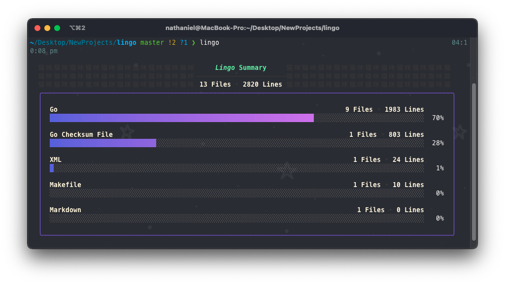
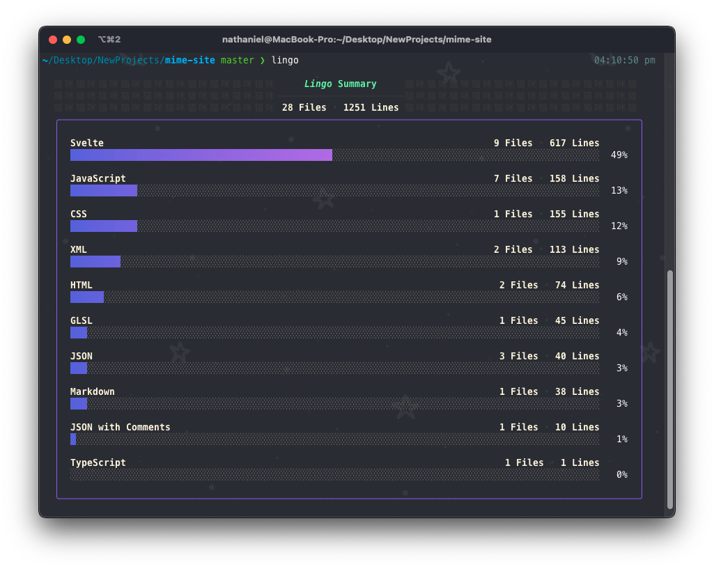
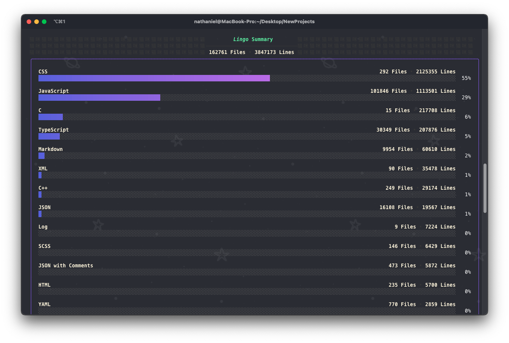

# _Lingo_

## A fast CLI tool for counting lines of code in a workspace.



Built with speed in mind, lingo can count lines of very large code repositories in under a second. [examples](#screenshots)

Lingo supports almost every programming language, if it's missing one feel free to make an `issue`

## Usage

### CLI

By default, lingo will count the lines of code in the current directory `.`. <br/>
However, a directory can be passed in.

Additionally lingo does not count `.gitignored` files, but this can be disabled by passing the `-n` flag.

```
USAGE:
    lingo [FLAGS] <directory>

FLAGS:
    -h, --help          Print help information
    -n, --nogitignore   Ignores any .gitignore files
```

### API

```go
import "github.com/nathanielfernandes/lingo/lingo"

func main() {
    // walks through the directory and returns a map of language names
    // to language objects
    /*  type Language struct {
	        Name  string
	        Files []string
	        Count uint32
	        Color string
        }
    */
    langs := lingo.GetLanguages(".", true)

    // Counts the lines of all the languages found, updating
    // the language objects
    langs.CountLines()

    // The lines are counted on goroutines. This wait, waits
    // for all the goroutines to complete
    langs.Wait()


    // if you just need the line count right away you can use
    langs.CountLinesNow()
    // This counts the lines and waits for the goroutines to
    // complete
}
```

## Screenshots

> all screenshots taken were of [iterm](https://iterm2.com/)



I used [bubbletea](https://github.com/charmbracelet/bubbletea) to create the clean ui.



In this screenshot lingo was called in a folder with around `50+ projects` amounting to `162,761 files` and `3,847,173` lines of code. All counted and displayed in approx. `5 seconds`

## Author

Nathaniel Fernandes nathaniel.s.fernandes@gmail.com

This project was inspired by [tokei](https://github.com/XAMPPRocky/tokei)
